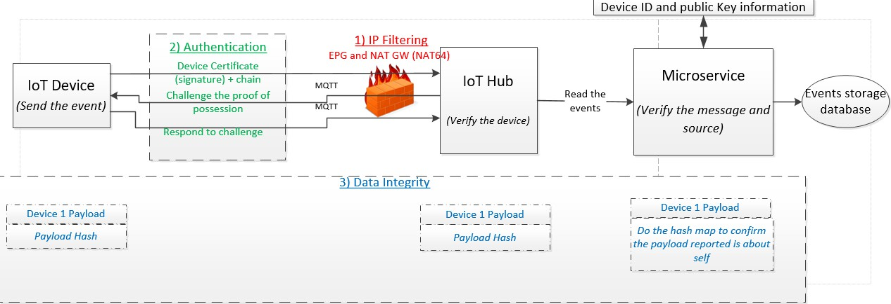
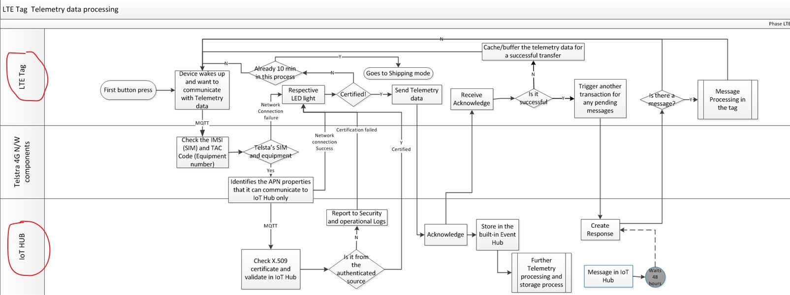
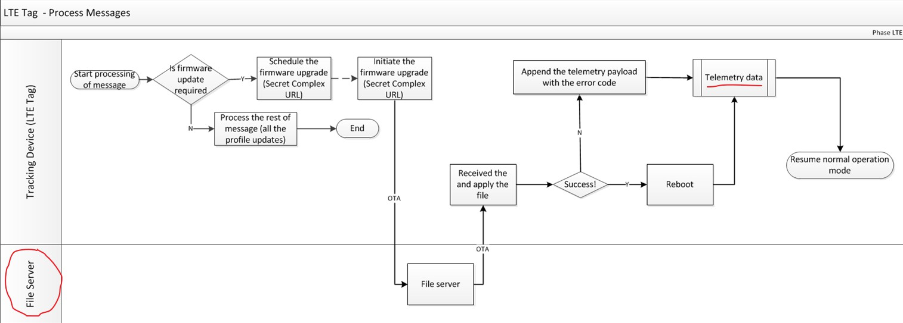
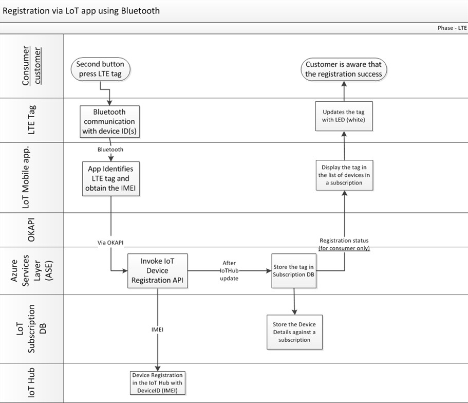

## 4.4 modes of operation

+ factory test mode
+ shipping mode --- low power mode
+ normal operation --- when button is pressed for the fisrt time.
+ OTA upgrad mode
+ factory reset --- push device into shipping mode
  + init by telstra from LoT platform
  + not reset internal statistics.

### 4.4.1 normal operation
+ device transmit its BLE adv packet *at the defined timing* --- 设备定时发送广播包
  + 默认操作：不中断持续发送广播包
  + eg：device发送广播包，用户通过运行智能手机上的app获取定位信息。

+ 通过BLE和设备建立连接，用以给设备发送特征信息（包括但不限于以下）：
  + factory reset
  + put device to sleeping mode/aeroplane mode
  + force a telemetry to be sent to IoT hub(azure provide)
  + play a tone on the buzzer.

### 4.4.2 OTA upgrade mode conditions
+ battery greater than 30%
+ been stationary greater than 30min
+ reasonable network coverage

## 4.5 authentication and security

### 4.5.1 device authentication
+ achieved through the following semi-automatic process
  + s1 acquire the x.509 certificate --- aquire *root certificate* and create an intermediate certificate
  + s2 register root certificate in the IoT hub
  + s3 share the intermediate certificate with the *inseego team*
  + s4 inseego define the levels of intermediate certificate required before the certificate is *generated* and *stored* in HSM chip of the device.
  + s5 Post device registration process, the device certificate is uploaded along with *certificate chain*.
  + s6 complete the authentication in background

### 4.5.2 data integrity
+ 设备侧对payload用sha-256进行hash认证，LoT平台侧解hash并和数据库中预存的hash值进行比较
  + 厂商必须设置用于保存设备ID和设备各自的数字签名的进程

## 4.6 LTE telemetry data, firmware upgrades and setting the device control parameters

### 4.6.1 telemetry data flow

### 4.6.2 message processing in the tag

### 4.6.3 device registration

## 4.7 led behaviour

## 4.8 button behaviour
### 4.8.1	Tracker in Shipping State
  + first press
  + second press

## 4.9 buzzer behaviour

## 4.10 battery level reporting(HIGH GOOD LOW CRITICAL)
